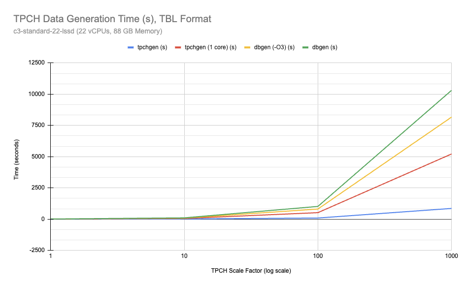

# Benchmarking Methodology

This directory contains a set of scripts to generate TPCH data at various scale factors:

# IO Throughput Limitations

[`tpchgen-cli`](tpchgen-cli/README.md) is the fastest TPCH generator we know of
at the time of this writing. On a 2023 Mac M3 Max laptop, it easily generates
data faster than can be written to SSD (which tops out about 1GB/s).

Use the `--stdout` to measure the throughput of the generator without being
limited by local disk I/O. For example:

```shell
# Generate SF=100, about 100GB of data, piped to /dev/null, reporting statistics
tpchgen-cli -s 100 --stdout | pv -arb > /dev/null
# Outputs something similar to
# 106GiB [3.09GiB/s] (3.09GiB/s)
# Benchmarking `TBL` format



The classic `dbgen` program produces data in a format known as
`TBL` (or `tbl`), which is a simple text format delimited by `|` characters.
Prior to the advent of open columnar formats like Parquet, running TPCH required
generating TBL formatted data and [loading into a database or data processing engine] before queries
could be executed. This format is still useful for benchmarking and comparison.

[loading into a database or data processing engine]: https://support.hpe.com/hpesc/public/docDisplay?docId=sf000078704en_us&docLocale=en_US


| Name                  | Generator | Output Format        | Notes                                    |
|-----------------------|-----------|----------------------|------------------------------------------|
| [tbl_tpchgen.sh]      | `tpchgen` | TBL                  |                                          |
| [tbl_tpchgen_1.sh]    | `dbgen`   | TBL                  | Restricted to 1 core (`--num-threads=1`) |
| [tbl_dbgen.sh]        | `dbgen`   | TBL                  |                                          |
| [tbl_dbgen_O3.sh]     | `dbgen`   | TBL                  | `dbgen` modified (compiled with `-O3`)   |


## `tbl_tpchgen.sh`

This script uses the `tpchgen-cli` command in this repo to produce a
single, uncompressed tbl file per table.

Example command for SF=10

```shell
tpchgen-cli -s 10
```

## `tbl_tpchgen_1.sh`

This script uses the `tpchgen-cli` command in this repo, restricted to using a
single core to produce a single, uncompressed tbl file per table.

This is useful for comparing the per-core performance of `tpchgen-cli` against
the classic `dbgen` program, which only supports single-threaded execution.

Example command for SF=10

```shell
# Scale factor 10
tpchgen-cli -s 10 --num-threads=1
```

## `tbl_dbgen.sh`

`dbgen` is the classic TPCH data generator program. This script uses an
unmodified copy of `dbgen` from
[electrum/tpch-dbgen](https://github.com/electrum/tpch-dbgen)

Example command for SF=10

```shell
git clone https://github.com/electrum/tpch-dbgen.git
cd tpch-dbgen
make
./dbgen -vf -s 10
```


## `tbl_dbgen_O3.sh`

The `makefile` that comes with the classic dbgen program uses the default
C compiler optimization level (`-O`). A more realistic comparison is using maximum
optimization (`-O3`), which is what this script does. 

This diff is applied to the `makefile` in the `tpch-dbgen` directory to change
the optimization level from `-O` to `-O3`. 

```diff
diff --git a/makefile b/makefile
index b72d51a..701c946 100644
--- a/makefile
+++ b/makefile
@@ -110,7 +110,7 @@ DATABASE= ORACLE
MACHINE = MAC
WORKLOAD = TPCH
#
-CFLAGS = -g -DDBNAME=\"dss\" -D$(MACHINE) -D$(DATABASE) -D$(WORKLOAD) -DRNG_TEST -D_FILE_OFFSET_BITS=64
+CFLAGS = -g -DDBNAME=\"dss\" -D$(MACHINE) -D$(DATABASE) -D$(WORKLOAD) -DRNG_TEST -D_FILE_OFFSET_BITS=64  -O3
LDFLAGS = -O
# The OBJ,EXE and LIB macros will need to be changed for compilation under
#  Windows NT
```

Example command for SF=10

```shell
git clone https://github.com/electrum/tpch-dbgen.git
cd tpch-dbgen
patch < path/to/your/patch/file.patch
make
./dbgen -vf -s 10
```

# Benchmarking Machine Setup

We tested using a Google Cloud Platform (GCP) virtual machine with the following
specifications:

* Machine type: c3-standard-22-lssd (22 vCPUs, 88 GB Memory)
* CPU platform: Intel Sapphire Rapids
* Architecture: x86/64

Here are the commands we used to configure the benchmarking machine:

## Install Softare
```shell
# install required packages
sudo apt-get install -y time g++ clang emacs git tmux mdadm make
# install rust
curl --proto '=https' --tlsv1.2 -sSf https://sh.rustup.rs | sh
# (logout / log in to add rust to path)
# Install duckdb:
curl https://install.duckdb.org | sh
sudo ln -s ~/.duckdb/cli/latest/duckdb /usr/local/bin
duckdb --version
# v1.2.1 8e52ec4395
```

## IO storage setup
Configure 4 local SSDs as RAID 0 Array mounted on `/data`
```shell
# setup drive on /data
sudo mdadm --create --verbose /dev/md0 --level=0 --raid-devices=4 /dev/nvme1n1 /dev/nvme2n1 /dev/nvme3n1 /dev/nvme4n1
sudo mkfs -t ext4 /dev/md0
sudo mkdir /data
sudo mount /dev/md0 /data
sudo chmod -R a+rwx /data
```

## Verify IO throughput for `/data`'

The `/data` filesystem tops out around 815 MB/sec when writing:

```shell
#  Test the IO throughput using `dd` 
dd if=/dev/zero of=/data/test1.img bs=1G count=10 oflag=dsync
# 10737418240 bytes (11 GB, 10 GiB) copied, 13.179 s, 815 MB/s
```

## install `tpchgen-rs`
```shell
cd /data
git clone git@github.com:clflushopt/tpchgen-rs.git
cd tpchgen-rs
cargo install --path tpchgen-cli
```


